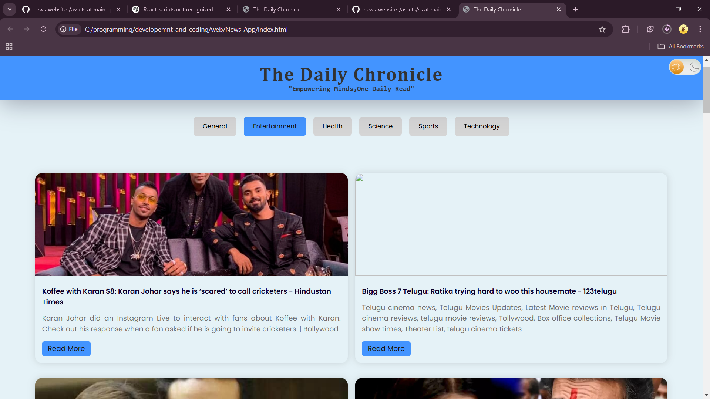

# News Website

This repository contains a news website project that fetches and displays news articles using an API. However, the original API used for fetching news data only supports requests from `localhost`. To overcome this limitation, two versions of the project have been created:



## Versions

### 1. Localhost Version
- Uses the original API to fetch live news data.
- Works only when running the project on `localhost`.
- Provides real-time updates.

### 2. Saved News Version
- Uses pre-saved news data instead of making API requests.
- Useful for showcasing the website’s functionality on production or public domains.
- Does not require an active API request.

## How to Use

### Using the Custom API Key
If you want to use your personal API for fetching news data, update the `script.js` file:

1. Open `script.js` in a text editor.
2. Locate the API key section.
3. Replace the existing API key with your own.
   ```js
   let apiKey = "your-personal-api-key";
   ```
4. Save the file and restart the project.

### Running the Project
- If using the **localhost version**, start a local server (e.g., using Live Server in VS Code).
- If using the **saved news version**, simply open `index.html` in a browser.

## Additional Notes
- Ensure that your API provider allows requests from external domains if deploying.
- The saved news version helps demonstrate the UI without requiring API access.

Feel free to modify and improve the project as needed! 🚀

